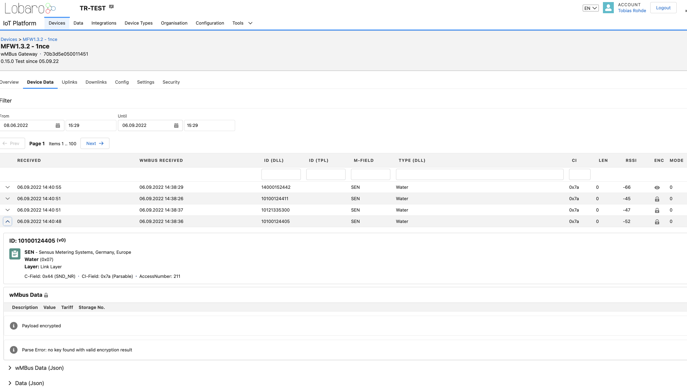

# Lobaro IoT Platform

The Lobaro IoT Platform operates as a **Head End System for IoT Devices**. The Platform is optimized for but not limited
to handle Lobaro devices.

- Public Lobaro instance: platform.lobaro.com
- For On-Premise hosting check out Hosting & Licensing

The documentation will always reference the Public Lobaro instance.

## Features
* Multi tenant (Organisations) with branding / white labeling
* IoT Device Management
* Support for all Lobaro Devices
* Possibility to integrate 3rd party IoT Devices (LoRaWAN, NB-IoT, ...)
* Device configuration
* Firmware updates
* Data parsing and persistence
* Device protocols:
  * LoRaWAN Network Server
  * CoAP
  * HTTP
  * Manufacturer specifics
* Connect devices via:
  * LoRaWAN
  * NB-IoT
  * LTE-M
  * GSM / LTE
  * etc.
* APIs to access or forward data to Use-Case specific applications