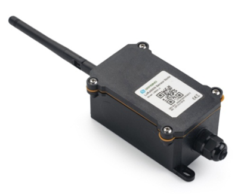

# Dragino

The Lobaro Platform supports a range of third party IoT devices. This page provides a quick setup guide for these devices.
For further details please consult the manufacturers documentation.

### NB-IoT Sensor Node for Temperature & Humidity (NBSN95A-S31B)



:::info[Resources]
* [Online Manual](http://wiki.dragino.com/xwiki/bin/view/Main/User%20Manual%20for%20LoRaWAN%20End%20Nodes/NBSN95_NBSN95A%20NB-IoT%20Sensor%20Node%20User%20Manual/)
:::


1. Insert your SIM Card
2. Connect a configuration cable to issue the commands below
    * Baud: 9600
    * Data bits: 8
    * Stop bits: 1
    * Parity: None
    * Flow Control: None


Enter the following password to access the device
```
12345678
```


TCP Upload to Lobaro Platform
```
AT+PRO=4
AT+SERVADDR=up.lobaro.com,5600
```

Upload data as often as possible (for testing purpose)
```
AT+TR=180
AT+TDC=60
AT+NOUD=1
```