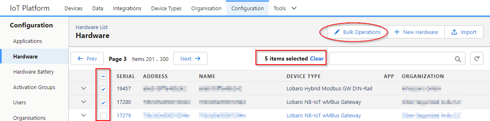
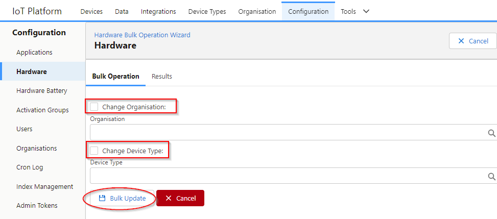

# Administration

:::info[Required roles] 
admin
:::

Global platform admins have access to the "Configuration" page from the main navigation.

The Configuration page gives access to entities independent of an Organisation.

## Hardware

On the hardware page, all devices independent of the organisation can be managed.

In the top right corner you can select different actions.

### Bulk Operations

Select one or multiple devices from the list to execute bulk updates like changing of the Organisation or Device Type.

* Select all relevant devices (search box and pagination can be used with out looking the selection)
* Click "Bulk Operations"

* A list of devices to update is shown below the form
* Select what properties update and click "Bulk Update"

### New Hardware

Create a new device. Each device needs:

* Address
* Name (optional, default is the Address)
* Device Type (optional, default is the "Generic Device")
* Organisation (optional)

### Import

Import Hardware from a CSV file.

#### CSV Import File Format

* Column names in first row

**Columns:**

| Column Name | Required                           | Type   | Description                                                                                                                                                                                                                                                                                                                                      |
|-------------|------------------------------------|--------|--------------------------------------------------------------------------------------------------------------------------------------------------------------------------------------------------------------------------------------------------------------------------------------------------------------------------------------------------|
| address     |                                    | string | Globally unique address of the device, e.g. IMEI or DevEUI. The address that is used to assign Uplinks to the device.                                                                                                                                                                                                                        |
| name        | optional                           | string | User friendly name of the device. Default: the address of the device.                                                                                                                                                                                                                                                                        |
| serial      | optional                           | string | Serial number printed on the device. For Lobaro devices, the firmware typically has no knowledge of the serial.                                                                                                                                                                                                                              |
| firmware    | optional                           | string | Initial Firmware name and version on the device as user friendly string                                                                                                                                                                                                                                                                          |
| config      | **deprecated** use cfg:`<key>` | json   | A whole config can be imported as JSON object. e.g. `{"key":"value"}` Warning: this requires a lot of escaping in CSV.                                                                                                                                                                                                                       | 
| cfg:`<key>` | optional                           | string | Initial config value of the device where `<key>` is the technical name of the config value.  Multiple of these columns can exist.  e.g. `cfg:DevEUI` to specify the config value of the parameter `DevEUI`.  Users can export the Initial config values on the "Hardware Activation" page based on the settings in the "Device Type" |

There are preferred config values for some device classes. Technically the name can vary, but might need some custom setup inside the device type.

**LoRaWAN**

LoRaWAN specific config keys:

* DevEUI - Unique address of the LoRaWAN Device
* JoinEUI - optional JoinEUI or AppEUI of the LoRaWAN device
* AppKey - AppKey of the LoRaWAN Device
* NwkKey - LoRaWAN 1.1 only