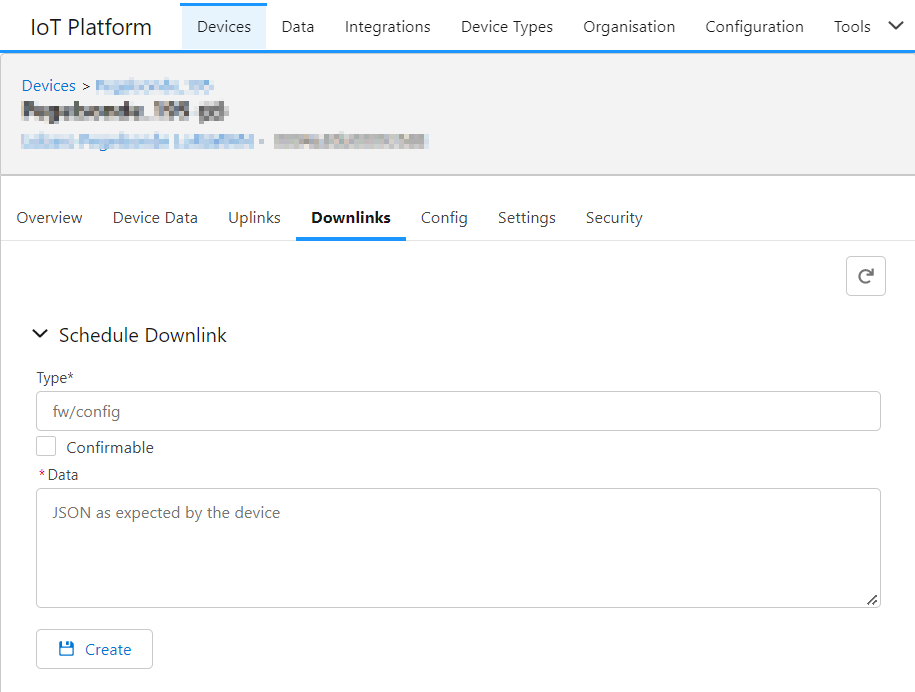

# Downlinks

:::info[Required roles]
* **Everybody** read access
* **device-admin** write access
:::



## Downlink Types

There are different downlink Types to be queued. For each type, there can only be one downlink queued at a time.
When queuing a new downlink of the same type, the existing one will be overwritten.

Each downlink need a `type` and `data` field. 
The `type` field is only used in the platform and not communicated with the device.

:::warning
The **JSON Format** in the examples might be subject to **change in future** and might **differ between devices**.
:::

### Config

Update config values of the device. Lobaro Devices will verify the new configuration (including a backend connection).
If the config is invalid it will be rolled back to the previous state and a "Config Error" will be reported.

**Type:** `config`

**Example Data:**
```json
{
  "d": {
    "mFilter": "LOB",
    "listenCron": "0 0/20 * * * *",
    "cmodeDurSec": "600"
  },
  "q": "config"
}
```

### Firmware

The application + secure boot firmware files to be downloaded by the device.

* `app`: Application firmware file (`device.app`)
* `boot`: Associated matching secure boot firmware file (`device.boot`)

:::info
The firmware for remote updates is different from the one used via the USB adapter!
:::

**Type:** `fw`

#### Update secure boot and app firmware

Example Data:
```json
{
  "d": {
    "app": "app-firmware-1.x.x-mcuboot-slot1.hex",
    "boot": "app-boot-nrf9160-sec-TZ2-1.8.2-mcuboot-slot1.hex"
  },
  "q": "fw"
}
```

#### Update only app Firmware

Example Data:
```json
{
  "d": {
    "app": "app-firmware-1.x.x-mcuboot-slot1.hex"
  },
  "q": "fw"
}
```

:::tip
Updating only the app firmware is the faster (since less data has to be downloaded by the device).

The appropriate boot firmware version for a particular application firmware can be obtained from Lobaro. 
The currently installed boot firmware can be read from the device properties (`device.boot`) in the Lobaro platform.

If in doubt use the command above that updates both firmware images.
:::

#### Update only secure boot Firmware

Example Data:
```json
{
  "d": {
    "boot": "app-boot-nrf9160-sec-TZ2-1.8.2-mcuboot-slot1.hex"
  },
  "q": "fw"
}
```

:::tip
If in doubt use the command above that updates both firmware images.
:::

#### Update modem firmware (detla)

Delta modem firmware updates can only be performed in patch version steps. Please consult Lobaro for available options.

* `mfw`: Associated matching delta modem firmware file provided by Nordic Semiconductor ("device.modem")


:::info
Only newer Lobaro firmware support this type of update, e.g. app-nrf9160-wmbus+0.24.0 onwards.
:::

Example Data:
```json
{
  "d": {
    "mfw": "mfw_nrf9160_update_from_1.3.2_to_1.3.4.bin"
  },
  "q": "fw"
}
```

### Lobaro Device Specific Downlinks


#### Reboot Device

Device will reboot when receiving this command.

**Type:** `fw`

Example data:
```json
{
  "q": "reboot"
}
```

#### Comment / Test

ASCII String that will be printed to device's Log when receiving this command.

**Type:** `fw`

Example data:
```json
{
  "d": "ASCII string to print to log",
  "q": "comment"
}
```

### LoRaWAN Downlinks

Send a lorawan downlink over the platform.

:::note
The integration with the LoRaWAN Network Server is required to send downlinks to the device. Integrations → LoRaWan, See also: [Integrations](../integrations/index.md)

At the moment only Chirpstack is supported for Downlinks.
:::

To send a downlinks via LoRaWAN a json object with the fields `type`, `data` and `fPort` must be queued.

* `data`: The data to be sent to the device
* `type`: Specifies the encoding of the data field. Valid options are:
  * `ascii`: The data field is a string that will be ascii encoded
  * `hex`: The data field is a hex encoded string (e.g. `0x01FF`)
  * `base64`: The data field is a base64 encoded string (e.g. `AQ==`)
* `fPort`: The LoRaWAN frame port to be used for the downlink. See device documentation for valid values.

**Type:** `lorawan`

```json
{
  "data": "scmodeDurSec=15",
  "type": "ascii",
  "fPort": 128
}
```
#### Chirpstack specifics

When you create a downlink it will be qued at the platform but only one downlink will be put into the downlink que of the chirpstack server at any time.

It's not possible to always know if a downlink was send by the Chirpstack server.
When a Device reconnects to the Chirpstack server with a new Join request Chirpstack drops the downlink queue for this device.
This and other cases will lead to situations where we can't say if a downlink was actually send by Chirpstack or not.

For more information observe the information in the downlink tab of your platform for the device or use the `api/devices/{devId}/downlink` API Endpoint.

Always keep in mind that even a successfully send downlink can get lost due to the nature of LoRaWAN

### Raw Format

Downlinks of type `config` and `fw` are always encoded in CBOR for Lobaro Devices.
It is also possible to send arbitrary data to other device. 

Supported 3rd Party Devices:
* Tektelek Devices support `ASCII` downlinks

**Type:** `raw`

**Fields:**
* `format`: Encoding of the data field. Valid options are:
  * `ascii`: The data field is a string that will be ascii encoded
  * `cbor`: The data field is a json object that will be cbor encoded
* `data`: The data to be sent to the device

This can also be used to mimic the `config` and `fw` downlink types.

Mimic Config Change:
```json
{
  "format": "cbor",
  "data": {
    "d": {
      "cmodeDurSec": 123
    },
    "q": "config"
  }
}
```

Mimic Reboot:
```json
{
  "format": "cbor",
  "data": {
    "q": "reboot"
  }
}
```

#### Tekelek Devices

Scheduling TCP/IP downlinks for Tekelek devices.

**Type:** `raw`

Example Data:
```json
{
  "format": "ASCII",
  "data": "ascii-downlink-payload"
}
```