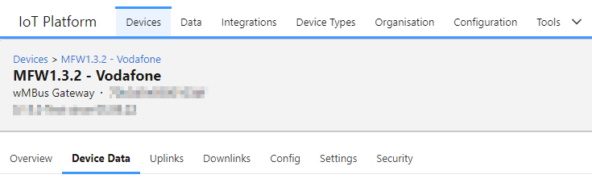
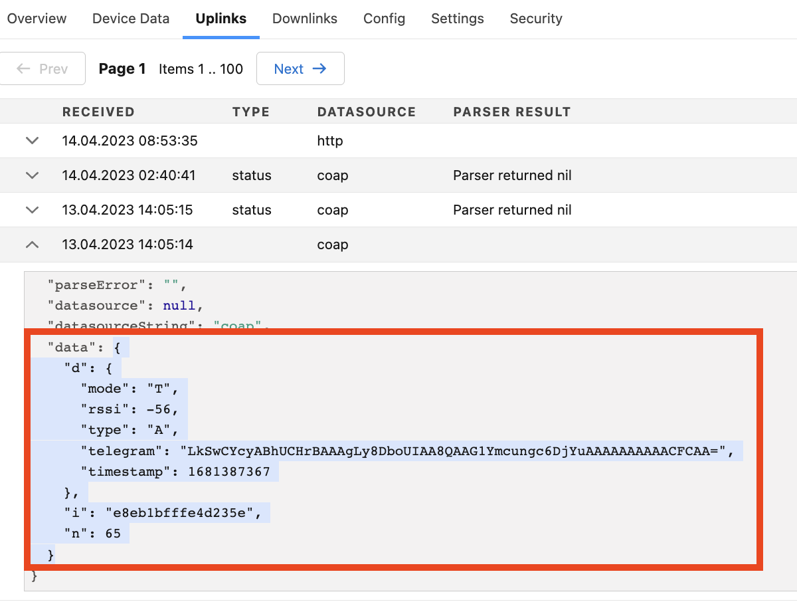
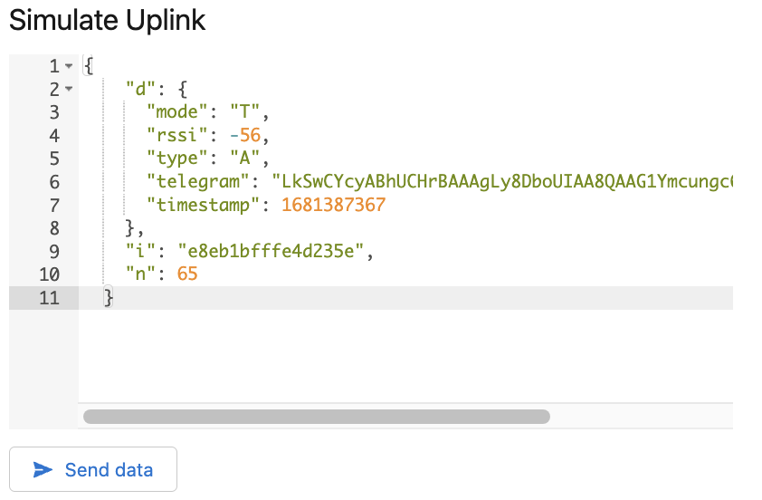
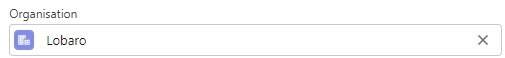
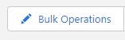
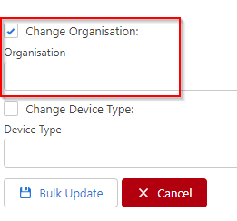

# Devices

A device represents a single physical IoT device that might consist of multiple Sensors and Actors.

Each device has a Device Type that defines the type of the device, e.g. how data is parsed, displayed and forwarded via integrations.

When opening the device page there are multiple sub pages:

* [Overview](#overview)
* [Device Data](#device-data)
* [Uplinks](#uplinks)
* [Downlinks](#downlinks)
* [Config](#config)
* [Settings](#settings)
* [Security](#security)

## Overview{#overview}

### Device Properties

Device Properties are bound to the device and can be manipulated (read / write) by the parser and via API's.

We are planning support to Edit the properties via the User Interface as well, deletion is already possible.

See "Edit Properties" button below the property list:

### Alerts

The feature is currently not supported.

### Location

The device can have a physical location. The location can be set via the Web UI, APIs and by the parser.

## Device Data{#device-data}

Device data lists all data records returned from the Parser.

The table is configured via the "Data Table Config" in the "Device Type".

## Uplinks{#uplinks}

Uplinks are raw sent messages from a device that were received and tried to be processed by the parser to create parsed records ("Device Data"). 

:::note[Parser returned nil]
Not all uplinks return a good data result, then the parser result is "Parser returned nil". 
This is **not** a general error, but a hint that no device data could be extracted from the uplink. 
Often this happens with status uplinks that do not contain user data but can be processed by the parser for meta information, 
e.g. battery voltage, that are shown under "Device Properties".
:::

### Simulate Uplinks

For test purposes, it may be useful to simulate uplinks through the platform and let the parser process them again. For this purpose, the "data" part of a past upload can be used, as shown in the highlighted part below.

The copied data can then be pasted in under the "Settings" Tab and send to the platform again for processing with a click on "Send Data". This data then appears again under "Uplinks" with "http" as datasource. Downstream processing, including any integrations, is then just as if the data had been sent from a physical device.

## Downlinks{#downlinks}

A list of queued and sent downlinks.

## Config{#config}

Requires Trait:

The config tab is only displayed when the Device Type has the Trait "Remote Config Update"

Allows to see and edit the device configuration.

Config properties must be updated by the parser, else the page is empty.

Updating configuration only works for NB-IoT devices yet (10/2022).

## Settings{#settings}

Edit devices Settings:

* Name - User friendly display name
* Address - used to identify the device when receiving Incoming data
* Serial - Serial number, provided in device import
* Device Tags - see below
* Description - User friendly description of the device
* Device Type
* App - Deprecated
* Datasource - allows to assign additional Pull or MQTT based datasources
* Parser - Parser to handle uplinks and generate device data

### Organisation

Each device belongs to a zero or one Organisation. There are multiple ways to move the device to another organisation.

:::info[Required roles]
admin, org-admin

* **org-admin** can move the device between different Sub Organisations in his Organisation tree.
:::

#### Single Device

Go to: Configuration → Hardware → Find and open the Device Page

Change the Organisation

Press Save

#### Bulk Operation

Go to: Configuration → Hardware

Select multiple devices

Click "Bulk Operations"

Change the Organisation and press "Bulk Update"

### Device Tags

Tags on device level are meant to group devices inside an organisation. Use cases can can be external ID's, Installation location, data export targets, etc.  
Some future plans are to filter by tag in integrations, display tags in the device table and use them for search, grouping, etc.

Currently the most important difference to device properties (where you can also story lists) is, that the parser has no write access to tags.  
Also a device with too many tags might get less handy, where device properties can be added as needed.

## Security{#security}

On the Security tab, all security related information about the device and it's connection can be found.

You can find information like:
* If DTLS is enabled for the device
* Certificate fingerprint of the device