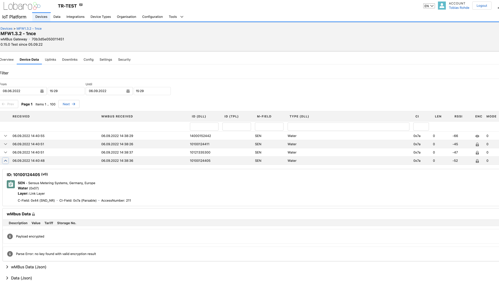
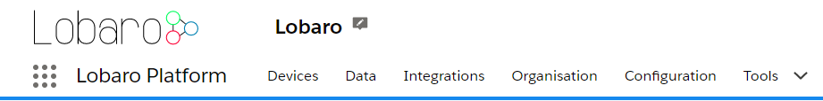
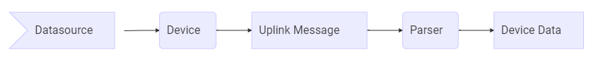

# Lobaro IoT Platform
---

The Lobaro IoT Platform operates as a **Head End System for IoT Devices**. The Platform is optimized for but not limited
to handle Lobaro devices.

- Public Lobaro instance: [platform.lobaro.com](https://platform.lobaro.com/)
- For On-Premise hosting check out [Hosting & Licensing](./license)

The documentation will always reference the Public Lobaro instance.

## Features

* Multi tenant (Organisations) with branding / white labeling
* IoT Device Management
* Support for all Lobaro Devices
* Possibility to integrate 3rd party IoT Devices (LoRaWAN, NB-IoT, ...)
* Device configuration
* Firmware updates
* Data parsing and persistence
* Device protocols:
    * LoRaWAN Network Server
    * CoAP
    * HTTP
    * Manufacturer specifics
* Connect devices via:
    * LoRaWAN
    * NB-IoT
    * LTE-M
    * GSM / LTE
    * etc.
* APIs to access or forward data to Use-Case specific applications
* Scaling to handle thousands of devices

We offer free access to the platform for tests and integrations (up to 12 Month) with the purchase of any Lobaro device
in our shared instance. In addition we offer private instance hosting or On-Premise (any Server with Root access).

## Overview

You can find your organisations name next to the Logo. Admins can change their organisation by clicking the small Icon
next to it.

* **Devices:** Manage all devices of your organisation.
* **Data:** See incoming data of all your devices.
* **Integrations:** Manage data connections to and from other applications. (See: [Integrations](integrations/index.md)).
* **Organisation:** Manage all organisation related data.
* **Configuration:** Platform administration of global entities independent of the Organisation (Admins only).
* **Tools:** wMbus Parser and Hardware Activation.

The platform shows device data received via various data sources like LoRaWAN, NB.IoT, GSM, etc.

The connection to a device in handled by a `Datasource`. Incoming data is mapped to a matching `Device`. Raw data is saved
as `Uplink` Message. The `Uplink` Message gets processed by a `Parser`. The result of the parser is saved as `Device Data` used
for visualization inside the dashboard and in outgoing APIs.

