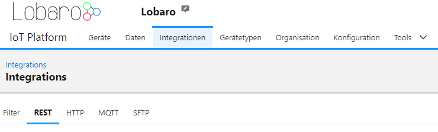

# Integrations

Integrations allows to exchange data between the Lobaro Platform and other applications.

Available integrations are:
- [REST Api](restapi.md)
- [LoRaWAN Network Server Integration](lorawan.md)
- [MQTT](mqtt.md)
- [HTTP forwarding](http.md)

