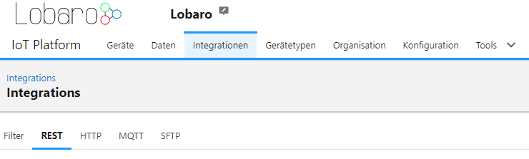

# REST API

## Navigation

- Go to: [Integrations -> REST](https://platform.lobaro.com/#/organisation/integrations/rest/)
- Swagger API documentation: [https://platform.lobaro.com/api](https://platform.lobaro.com/api)

### Access Tokens

All API calls must be authenticated with an access token. Access tokens can be managed on the **REST Integration** page.

Each token has a list of roles assigned to it.

#### Token Roles:

- **network-server**: Allows writing device data. Required for LoRaWAN Network Server integrations.

Include the token in the HTTP request header as follows:

- **Field**: `Authorization`
- **Value**: `Bearer eyJhbGciOiJIU...`

### Pagination

Pagination is required to query large datasets.

| Query Parameter | Default | Maximum Value | Description                              |
|-----------------|---------|---------------|------------------------------------------|
| `limit`         | 100     | 10,000        | Maximum number of records to retrieve.   |
| `offset`        | 0       | N/A           | Offset for the first record to retrieve. |

To fetch all data from an endpoint, adjust the offset:

- `?limit=100&offset=0`
- `?limit=100&offset=100`
- Continue increasing the offset by the limit until the number of returned rows is less than the limit.

### Filter Query Parameters

Filters can be added to requests in the form of `<type>:<field>=<op>:<value>`, e.g., `f:createdAt=gt:<timestamp>` to
filter by creation date.

- `<type>`: "f" for fields, or "fa" for arrays (e.g., to search in tags).
- `<field>`: The field being queried (e.g., "id", "createdAt", "updatedAt").
- `<op>`: Operator, see below for allowed operators.
- `<value>`: URL-encoded query value (e.g., `gt:2000-01-01T02:37:00%2B01:00`).

#### Allowed Operators:

| Operator      | Meaning                                                              | Valid for  |
|---------------|----------------------------------------------------------------------|------------|
| `eq`          | `=` (equals)                                                         | `f`        |
| `lte`         | `<=` (less than or equal)                                            | `f`        |
| `lt`          | `<` (less than)                                                      | `f`        |
| `gte`         | `>=` (greater than or equal)                                         | `f`        |
| `gt`          | `>` (greater than)                                                   | `f`        |
| `like`        | SQL `LIKE` operator                                                  | `f`        |
| `ilike`       | SQL `ILIKE` operator (case-insensitive LIKE)                         | `f`        |
| `isnull`      | SQL `is (not) null`. Values: "true" (is null), "false" (is not null) | `f` / `fa` |
| `contains`    | Array field contains all specified values                            | `fa`       |
| `containedby` | Array field is contained by the specified list of values             | `fa`       |
| `overlap`     | Array field and list of values overlap                               | `fa`       |

_Default operator: `eq` for fields and `contains` for arrays._

#### Examples:

1. Query JSON field `data.mbus.Id` for a number:
    - `&f:data.mbus.Id=eq:130567728`
2. Query JSON field `data.mbus.IdString` for a string:
    - `&f:data.mbus.IdString=eq:"10130567728"`

For date ranges, apply the same filter multiple times with different operators:

- `&f:receivedAt=gt:2000-01-01T02:37:00%2B01:00&f:createdAt=lt:2000-01-02T02:37:00%2B01:00`

### Usage Recommendations:

- Set the gzip encoding header to reduce network traffic.
- Use pagination with page sizes smaller than 10,000 entries.
- Prefer `receivedAt` over `createdAt` for time-based queries.

## Example Requests

### Get Data from a Single Device by Address or Tag

Find relevant device(s):

- **By Address**:  
  `https://platform.lobaro.com/api/devices?limit=100&offset=0&f:addr=eq:352656100677000`
- **By Tag**:  
  `https://platform.lobaro.com/api/devices?limit=100&offset=0&fa:tags=contains:my-tag,another-tag`

Use the `data.id` field from the first query to fetch device data. Replace `{deviceId}` with the actual device ID:
- `https://platform.lobaro.com/api/devices/{deviceId}/parsed-data?limit=100&offset=0&f:createdAt=gt:2000-01-01T02:37:00%2B01:00`
