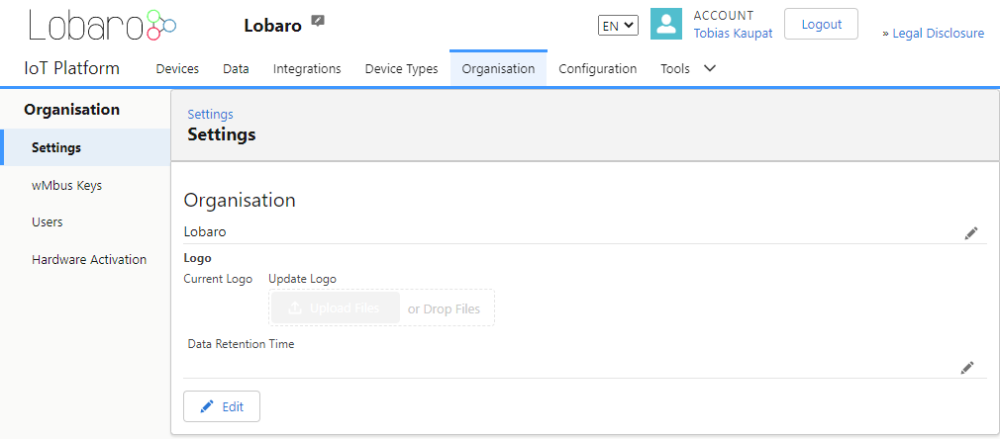
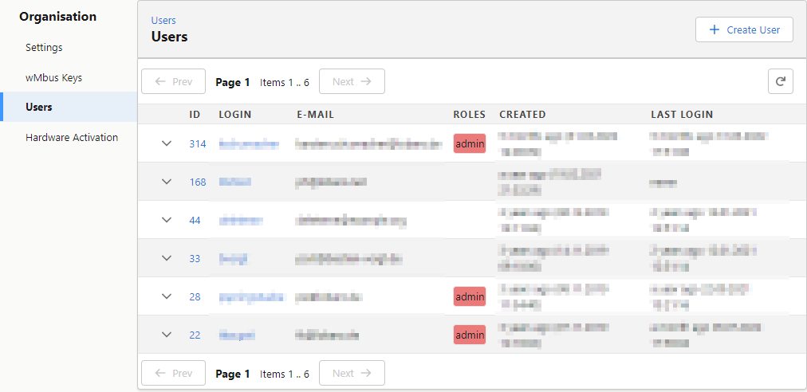

# Organisation

:::info[Required roles]
* **org-admin**
:::

The Organisation page allows to manage Organisation related settings like Name, Logo, Users, etc.

## Settings

Manage the Name, Logo and other organisation related settings.

## wMbus Keys

See: [wMbus Keys](wmbus-keys)

## Users

Manage Users and Roles inside the organisation.

### Roles

| Role         | Rights                                                                                            | Comment                                             |
|--------------|---------------------------------------------------------------------------------------------------|-----------------------------------------------------|
| admin        | Global Platform Admin Can access all Organisations.                                           | Admin users can only seen by other platform admins. |
| org&#x2011;admin    | Organisation Admin Can edit all Organisation related data including Devices and Integrations. |                                                     |
| device&#x2011;admin | Device Admin Can edit all Device related data inside the Organisation.                        |                                                     |
