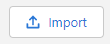
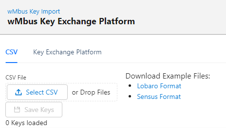
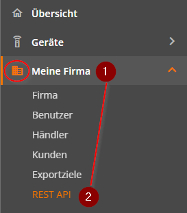
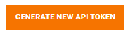

# wMbus Keys

:::info[Required roles]
* **org-admin**
  :::

## Import

Allows to import Keys from CSV. The page offers compatible examples to be used as template for the import.

### Import via Key Exchange Platform

You do need an account in the Exchange Plattform, see: https://exchange-platform.app/

Generate a new Token

Add a Label and select "Device API"

The Token will appear in the table, copy the token for usage in the Lobaro Platform.

Enter the Token in the Lobaro Platform under `Organisation → wMbus Keys → Import → Key Exchange Platform`:

