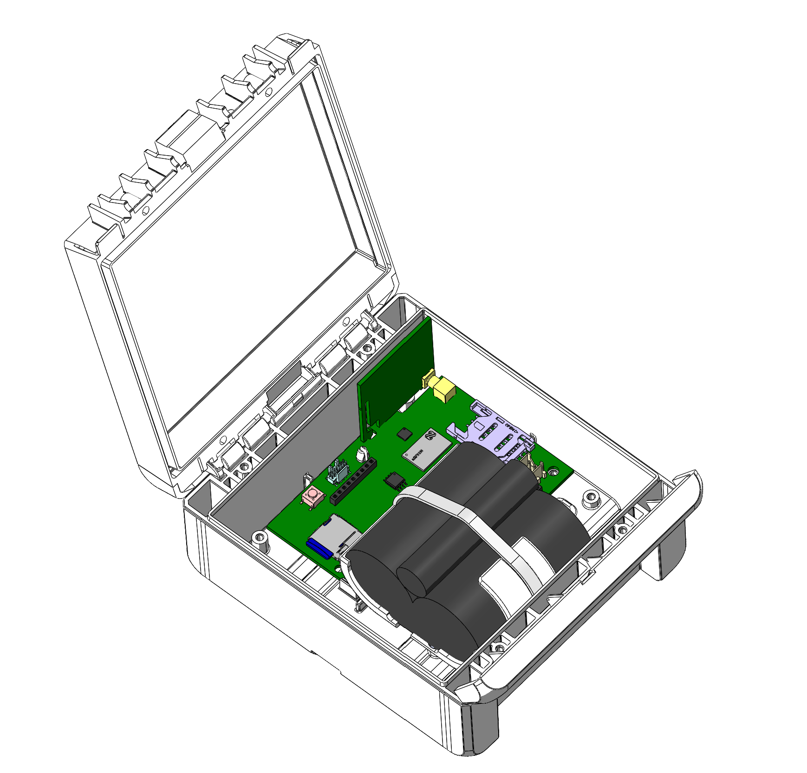

# Wmbus Gateway V4

<Image alt='A battery powered V4 Gateways'
img={require('./img/wMBusV4_Batterie.png')}
style={{width: '60%', padding: '10px', marginInline: 'auto'}}/>

## Features
- Type: LOB-GW-HYB-WMBUS-BL
- Upload via NB-IoT mobile radio (LTE bands: 3, 8, 20)
- SIM card (4FF / Nano) - not included
- Alternative upload via LoRaWAN v1.0.2 (EU-868)
- Compatible with wireless M-Bus S1, C1/T1 modes (868 MHz), OMS v3 & v4
- Compatible with Sensus RF (BUP, 868 MHz)
- Upload of up to 500 different meters
- Power supply: 3.3-5V via JST XH connector
- Matching battery pack - not included
- IP66 housing: 151 (l) x 125 mm (w) x 60mm (h)
